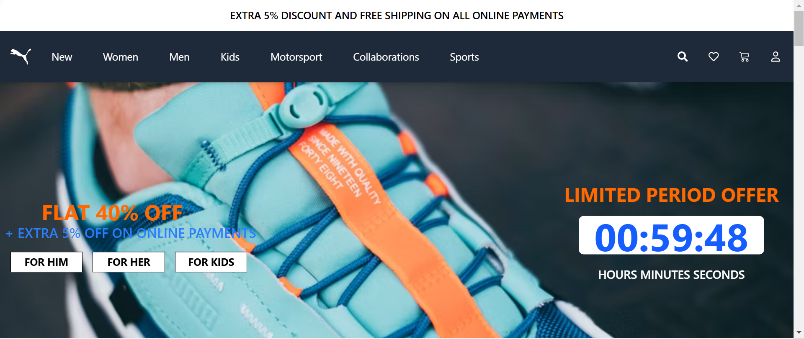
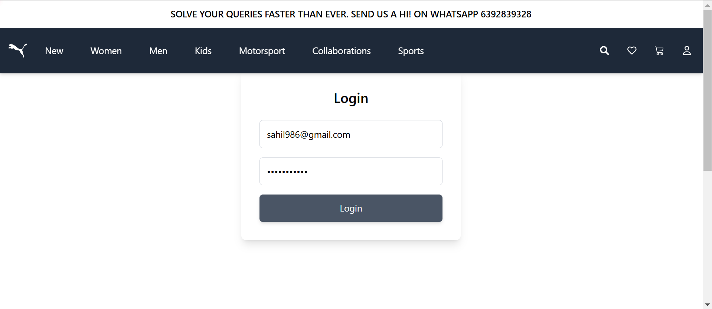
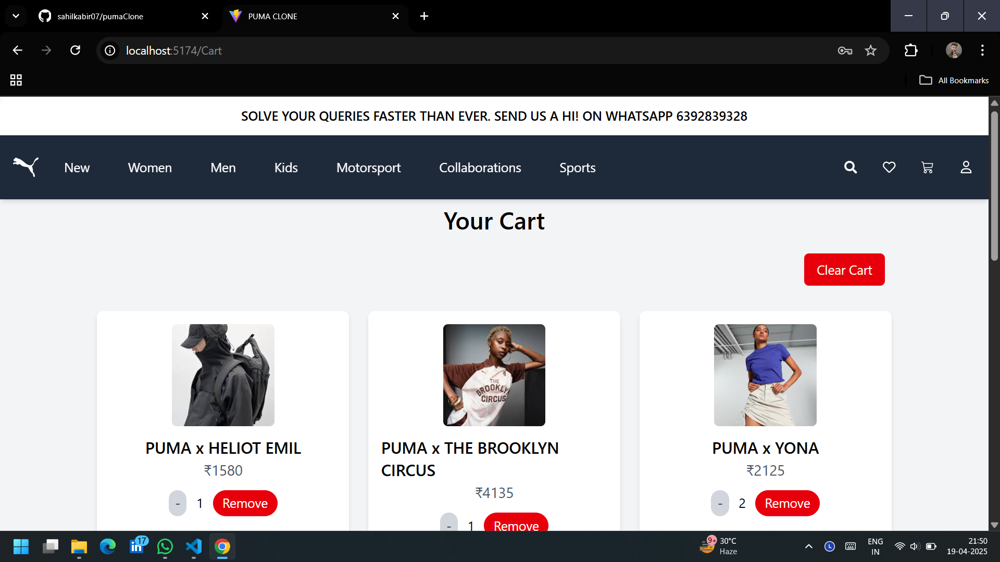
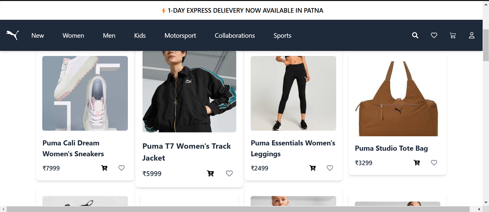

# PUMA CLONE
[LIVE LINK](https://puma-clone-upyl.vercel.app/)

# ✨ Puma Website Clone

A fully functional **Puma eCommerce website clone** built with **React, Firebase Authentication, Local Storage, and React Router**. This project includes features like **Add to Cart, Liked Products, Search Functionality, and User Authentication**.

---

## 🚀 Features

✅ **User Authentication** (Sign Up, Login, Logout) using Firebase  
✅ **Product Search** across multiple categories  
✅ **Add to Cart** with Local Storage support  
✅ **Like Products** and view them on a separate page  
✅ **Responsive Design** for a seamless mobile and desktop experience  
✅ **React Router Navigation** for smooth page transitions  
✅ **Loading Bar & Toast Notifications** for enhanced UI/UX  

---

## 🖼️ Screenshots


### **Homepage**


### **Login Page**


### **Cart Page**


### **Items Page**


### **Abouta Us Page**


## ⚙️ Tech Stack

- **Frontend:** React.js, React Router, Tailwind CSS  
- **State Management:** useState, Context API  
- **Authentication:** Firebase Authentication  
- **Storage:** LocalStorage  
- **UI Enhancements:** React Toastify (Notifications), React Top Loading Bar  

---

## ⚙️ Installation & Setup

### **1️⃣ Clone the Repository**
```bash
git clone https://github.com/your-username/puma-clone.git
cd puma-clone
```

### **2️⃣ Install Dependencies**
```bash
npm install
```

### **3️⃣ Create an `.env` File**
Set up Firebase environment variables in a `.env` file:  
```plaintext
VITE_API_KEY=your_firebase_api_key
VITE_AUTH_DOMAIN=your_firebase_auth_domain
VITE_PROJECT_ID=your_firebase_project_id
VITE_STORAGE_BUCKET=your_firebase_storage_bucket
VITE_MESSAGING_SENDER_ID=your_firebase_messaging_sender_id
VITE_APP_ID=your_firebase_app_id
VITE_MEASUREMENT_ID=your_firebase_measurement_id
```

### **4️⃣ Run the Development Server**
```bash
npm run dev
```
Your project should now be running on **`http://localhost:5173`** 

---

## 🔑 User Authentication (Firebase)
- New users can **Sign Up** and log in securely.  
- Users remain logged in until they log out.  
- Protects routes using **`onAuthStateChanged`** in Firebase.  

---

## 🛒 Add to Cart & Liked Products
- **Cart items are saved in Local Storage**, ensuring data persistence.  
- **Liked Products** feature lets users bookmark their favorite items.  

---

## 🔍 Global Search Feature
- Users can **search for products** across different categories.  
- Results are displayed dynamically on a separate **Search Results** page.  

---

## 📌 Folder Structure
```
/puma-clone
├── /src
│   ├── /Components
│   │   ├── Header.jsx
│   │   ├── Footer.jsx
│   │   ├── HomePage.jsx
│   │   ├── /Men
│   │   ├── /Women
│   │   ├── /Kids
│   │   ├── /Cart
│   │   ├── /Liked
│   │   ├── FireBase
│   │   │   ├── AuthPage.jsx
│   │   │   ├── LogIn.jsx
│   │   │   ├── SignUp.jsx
│   │   │   ├── FireBase.js
│   ├── App.jsx
│   ├── main.jsx
│   ├── index.css
│   ├── SearchContext.jsx
├── .env
├── package.json
├── README.md
```

---

## 🎯 Future Improvements
🔹 Add a **Payment Gateway** (e.g., Stripe)  
🔹 Implement a **Wishlist Feature**  
🔹 Improve **Animations & Transitions**  
🔹 Add **Backend with Node.js & MongoDB**  

---

## 💡 Contributing
Contributions are welcome! If you'd like to contribute:  
1. **Fork the repo**  
2. **Create a new branch** (`feature/your-feature-name`)  
3. **Commit your changes**  
4. **Push to GitHub** and **create a pull request**  

---

## 📩 Contact
🔹 **Sahil Akhtar**  
🔹 **Email:** sahilakthar8986@gmail.com  
🔹 **GitHub:** [sahilkabir07](https://github.com/sahilkabir07)  

---

### 🌟 If you like this project, don't forget to star ⭐ the repository!  

